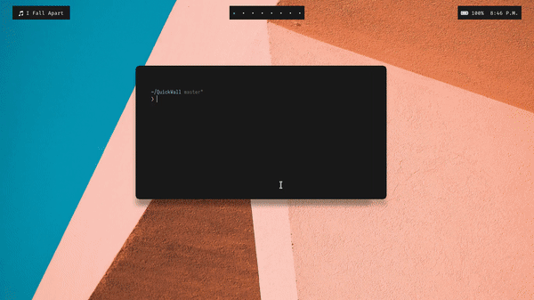

<h1 align="center">QuickWall</h1>

<div align="center" style="padding-top: 2em !important; padding-bottom: 2em; !important">
    
</div>


<div align="center">
<br/>

<a href="#how-it-works">How It Works</a>&nbsp;&nbsp;&nbsp;|&nbsp;&nbsp;&nbsp;<a href="#installation">Installation</a>&nbsp;&nbsp;&nbsp;|&nbsp;&nbsp;&nbsp;<a href="#requirements">Requirements</a>&nbsp;&nbsp;&nbsp;|&nbsp;&nbsp;&nbsp;<a href="#usage">Usage</a>&nbsp;&nbsp;&nbsp;|&nbsp;&nbsp;&nbsp;<a href="#todo">TODO</a>&nbsp;&nbsp;&nbsp;|&nbsp;&nbsp;&nbsp;<a href="#acknowledgements">Acknowledgements</a>&nbsp;&nbsp;&nbsp;
<br/><br/>

[](https://www.python.org/)<br/><br/>
 [](LICENSE)   [](http://makeapullrequest.com)

</div>

## How It Works

It detects your DE or WM, gets wallpapers from **Unsplash** and sets them using either your choice of wallpaper setter or by **nitrogen**. Not enough? It can also change your theme based on the wallpapers that it gets, thanks to [pywal](https://github.com/dylanaraps/pywal).


## Installation

* It is available in Pypi

```sh
pip3 install QuickWall
```

* Available in AUR [here](https://aur.archlinux.org/packages/quickwall/)

```sh
yay -S quickwall
```

> **NOTE**: The directory is changed from ```~/.QuickWall``` to ```~/.cache/QuickWall```. Early users can use ```--migrate``` option to move their data.

### OR

* Run the following command in the root directory to install QuickWall.

```sh
python setup.py install
```

> **NOTE**: If you get **permission denied** error, run the above command with sudo.

## Requirements

1. Python 3.6+
2. Currently supported wallpaper setters

    - [nitrogen](https://github.com/l3ib/nitrogen)
    - [feh](https://github.com/derf/feh)
    - [kde](https://github.com/KDE/plasma-desktop)

> **NOTE**: These dependencies in linux can be installed in other variants.  
> For *arch linux*, you can use **pacman** package manager accordingly.

## Usage

```console
usage: QuickWall [-h] [--version] [--clear-cache] [--setter SETTER]
                 [--disable-blacklist] [--disable-theme] [--remove-id ID]
                 [--dir DIR] [--id ID] [--random] [--search TERM] [--migrate]

QuickWall - Quickly set latest wallpapers from Unsplash directly from the
commandline.

optional arguments:
  -h, --help           show this help message and exit
  --version            show the program version number and exit
  --clear-cache        Clear the cache from the cache folder
                       (~/.cache/QuickWall)
  --setter SETTER      Wallpaper setter to be used. Currently supported ones:
                       nitrogen, feh, kde (default: auto)
  --disable-blacklist  Disable adding the image to blacklisted ones.
  --disable-theme      Disable setting themes using pywal.
  --remove-id ID       Remove the passed ID from the blacklist.
  --dir DIR            Directory to download the wallpapers
  --id ID              Get a photo by its ID.
  --random             Get random wallpapers.
  --search TERM        Show wallpapers based on the passed term
  --migrate            ONLY FOR EARLY USERS. Move the files from ~/.QuickWall
                       to ~/.cache/QuickWall.

If you find any bugs, feel free to raise an issue in the GitHub
[https://github.com/deepjyoti30/QuickWall] page.

```

## TODO

- Add tests
- Add support for different wallpaper setters (raise an issue if you want me to support some particular one)
- Handle errors better
- Add automatic detection of wallpaper setter depending on the OS. Fallback would be nitrogen.
- ~~Add support to restore wallpapers for KDE.~~
- ~~Add a logger~~
- ~~Add support to search~~

## Acknowledgements

- [Unsplash](https://unsplash.com) for their awesome API.
- [Pavel Borisov](https://github.com/pashazz) for [ksetpaper](https://github.com/pashazz/ksetwallpaper) code.